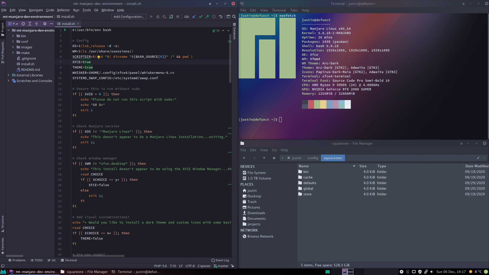

# Modern Tribe Development Environment for Manjaro Linux (XFCE)

This script automatically installs and configures packages that I use as a backend developer at Modern Tribe.
It also configures my personal look and feel for the desktop environment, which is optional.

Even if you don't agree with my style, this will give you a good starting point to customize further.

## Installation prerequisites

Before using this install script, make sure you have installed the latest [Manjaro XFCE Edition](https://manjaro.org/downloads/official/xfce/).

## Installation

`git clone https://github.com/moderntribe/mt-manjaro-dev-environment`

`cd mt-manjaro-dev-environment; ./install.sh`

Answer the questions the script asks you. This script was meant to run on a fresh install of Manjaro linux.
Running it again will overwrite any custom settings you've set.

## FAQ

### Why Manjaro Linux?

I've distro hopped a lot and this ended up being my favorite for performance, hardware support and stability. Manjaro is based on [Arch](https://www.archlinux.org/) but holds back the latest
releases for testing before they reach Manjaro. Manjaro is a rolling release distro, meaning you only have to update packages and never have to do a distro update down the road.

### Why XFCE?

XFCE is a mature, lightweight and configurable desktop environment that doesn't get in the way.

### What gets installed?

Check out the [pkglist.txt](conf/pacman/pkglist.txt) and [aur.txt](conf/pacman/aur.txt) for a list of packages that get installed. The script
also installs some other packages that aren't in the downstream including [nvm](https://github.com/creationix/nvm).

If you agree to install the visual customizations, the script will install the [Arc Theme](https://github.com/horst3180/arc-theme).

### Why are you using AUR?

[AUR](https://aur.archlinux.org/) is a repository of user contributed packages. I did try using snaps (snap does get installed with this script...), but I found the performance was not quite as good.
You can always remove the packages and install them with [Snap](https://snapcraft.io/) instead or examine the PKGBUILD files of each package yourself. This really isn't that different from using
custom PPA's in Debian.

**However, use this script at your own risk!**

## Credits

Confix Script: https://github.com/budhash/confix
 
